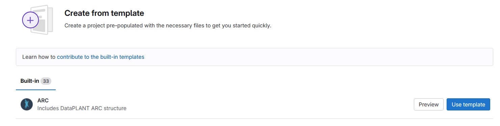

# Introduction

The focus of this years ARC symposium was on improving ARC interoperability with existing research data infrastructures (RDIs) and selected parts of the ARC ecosystem such as validation, FAIR digital object (FDO) publication, and visualization.
This paper combines all project into a single report. Next year we might split the reports into separate papers.

# Reports

## Project 1: ARC template repositories

_Members: Sabrina Zander, Stella Eggels_

### Context

Users that want to initiate a project following the ARC Scaffold structure can directly use ARC templates on the DataHUB.
A minimal ARC template provides the basic folder structure (`/studies`, `/assays`, `/workflows`, `/runs`, top-level `investigation` metadata descriptor) with explanations in the `README.md` file [CITE ARC SPECS].
Existing ARC templates were outdated in regards of the ARC specification and no experiment-specific templates were available.

### Consequences

We updated the existing ARC template to the latest version of the ARC specification (at the point of writing [CITE ARC SPECS]) and created two examples of experiment-specific ARC templates (Genomics and Metabolomics).
These additional experiment-specific ARC templates can provide a starting point for new ARC creators that provide suggestions for suitable studies, assays, and metadata templates in the ISA files, as well as a suggestion for a `README.md` structure.

Template ARCs are currently stored in an `arc_templates` group on the DataHUB: https://git.nfdi4plants.org/arc_templates.
We discussed that in the future they should probably be moved to a dedicated repository (e.g., on GitHub), where one repository will be needed per ARC template.
To not overload the nfdi4plants GitHub organization, an extra arc template organization might be the best solution if there is sufficient usage.
Once the implementation is finalized, when creating a new project in the DataHUB the option "create from template" allows to select from the different ARC templates and initiate an ARC following their structure.
All GitLab default templates can most likely be deleted.



### Automation

The amount of requests and usage of experiment-specific ARC templates should be monitored to decide when to move them to a dedicated repository.

## Project 2: SQL-to-ARC

### Context

In the NFDI FAIRagro [CITE FAIRAGRO] project we want to connect several Research Data Infrastructures (RDIs) with a common middleware that is
ARC/Datahub-based [CITE PLANTDATAHUB]. The challenge is to convert the meta data offered by those RDIs to
ARC.

One idea to tackle that is to create an SQL-to-ARC converter that maps the SQL schema of existing RDIs to the ARC metadata model.

### Consequences

We assume to have access to the RDI's SQL database. We create new views in that database
that correspond to entities within the ARC context. E.g:

* `ARC_investigation`
* `ARC_study`
* `ARC_assay`
* `ARC_person`
* `ARC_sample`
* `ARC_sample_characteristic`

Then we use an ARCtrl-based [CITE ARCTRL] software (written in python) to perform the actual conversion.
The prototype can be found here: git@github.com:fairagro/m4.2_SQLToARC.git (currently private) [make repo public or include in this repo].

### Automation

## Project 3: ARC Workflow Run RO-Crate Profile integration with Galaxy

### Context

### Consequences

### Automation

## Project 4: OMERO-ARC Interoperability via RO-Crate

### Context

### Consequences

### Automation

## Project 5: Improvements to the ARC FDO publication process

### Context

### Consequences

### Automation

## Project 6: Swate graph view

### Context

### Consequences

### Automation

## Project 7: OntologyProvider

### Context

### Consequences

### Automation

## Meeting information

If you want to submit a preprint to BioHackrXiv, first check if your meeting is registered. You can find a list
of meetings [here](https://index.biohackrxiv.org/meetings). If your meeting is missing, please contact your meeting
organizers. The above list also provides information on the YAML fields with information about the meeting.

The following fields need to be given:

```YAML
biohackathon_name: "BioHackathon Europe 2023"
biohackathon_url:   "https://biohackathon-europe.org/"
biohackathon_location: "Barcelona, Spain, 2023"
group: Project 26
git_url: https://github.com/yourOrganization/your_report_repo
```

The [BioHackrXiv meeting pages](https://index.biohackrxiv.org/meetings) provide content to use for the first
three fields. The `git_url:` field must have the link to the GitHub repository with your preprint (draft).

## Author information

Information about the authors is given in the [YAML](https://en.wikipedia.org/wiki/YAML) format at the top of this template.
For authors you provide their names, their affiliations. That is the minimum, but as BioHackrXiv is moving to a situation
where more metadata is shared, and used by, for example, EuropePMC, adding additional information ie encouraged.

BioHackathons is about hacking together, and the minimal number of authors for reports is two. This makes a minimal example
look like this:

```yaml
authors:
  - name: First Author
    affiliation: 1
  - name: Last Author
    affiliation: 2
affiliations:
  - name: First Affiliation
    index: 1
  - name: ELIXIR Europe
    index: 2
```

### Author identifiers

Ideally, authors provide their [ORCID](https://orcid.org/) identifier. For affiliations, It is added with the `orcid:` field.
So, and author record would look like this:

```yaml
authors:
  - name: First Author
    affiliation: 1
    orcid: 0000-0000-0000-0000
```

### Research Organization Registry identifiers

Matching the author identifier, the affiliations can be further specified with the
[Research Organization Registry](https://ror.org/) (ROR) identifier.
For example, this is the affiliation identifier can be added with the `ror:` field:

```yaml
affiliations:
  - name: ELIXIR Europe
    ror: 044rwnt51
    index: 2
```

### Contributor Role Taxonomy

A last feature since is minimal support for the Contributor Role Taxonomy (CRediT). You
can specify the role of authors in writing the report with the `role:` field. However,
the authors are responsible for selection the right terms from [CRediT](https://credit.niso.org/).
An example looks like this:

```yaml
authors:
  - name: First Author
    affiliation: 1
    orcid: 0000-0000-0000-0000
    role: Conceptualization, Writing – review & editing
```

### A full examples

A full example then has this structure:

```yaml
authors:
  - name: First Author
    affiliation: 1
    role: Writing – original draft
  - name: Last Author
    orcid: 0000-0000-0000-0000
    affiliation: 2
    role: Conceptualization, Writing – review & editing
affiliations:
  - name: First Affiliation
    index: 1
  - name: ELIXIR Europe
    ror: 044rwnt51
    index: 2
```

# Formatting

This document use Markdown and you can look at [this tutorial](https://www.markdowntutorial.com/).

## Subsection level 2

Please keep sections to a maximum of only two levels.

## Tables

Tables can be added in the following way, though alternatives are possible:

```markdown
Table: Note that table caption is automatically numbered and should be
given before the table itself.

| Header 1 | Header 2 |
| -------- | -------- |
| item 1 | item 2 |
| item 3 | item 4 |
```

This gives:

Table: Note that table caption is automatically numbered and should be
given before the table itself.

| Header 1 | Header 2 |
| -------- | -------- |
| item 1 | item 2 |
| item 3 | item 4 |

## Figures

A figure is added with:

```markdown

```

This gives:


Figures can be scaled by adding the width or height to the Markdown like this:

```markdown
{ width=50px }
```

# Other main section on your manuscript level 1

Lists can be added with:

1. Item 1
2. Item 2

# Citation Typing Ontology annotation

You can use [CiTO](http://purl.org/spar/cito/2018-02-12) annotations, as explained in [this BioHackathon Europe 2021 write up](https://raw.githubusercontent.com/biohackrxiv/bhxiv-metadata/main/doc/elixir_biohackathon2021/paper.md) and [this CiTO Pilot](https://www.biomedcentral.com/collections/cito).
Using this template, you can cite an article and indicate _why_ you cite that article, for instance DisGeNET-RDF [@citesAsAuthority:Queralt2016].

The syntax in Markdown is as follows: a single intention annotation looks like
`[@usesMethodIn:Krewinkel2017]`; two or more intentions are separated
with colons, like `[@extends:discusses:Nielsen2017Scholia]`. When you cite two
different articles, you use this syntax: `[@citesAsDataSource:Ammar2022ETL; @citesAsDataSource:Arend2022BioHackEU22]`.

Possible CiTO typing annotation include:

* citesAsDataSource: when you point the reader to a source of data which may explain a claim
* usesDataFrom: when you reuse somehow (and elaborate on) the data in the cited entity
* usesMethodIn
* citesAsAuthority
* citesAsEvidence
* citesAsPotentialSolution
* citesAsRecommendedReading
* citesAsRelated
* citesAsSourceDocument
* citesForInformation
* confirms
* documents
* providesDataFor
* obtainsSupportFrom
* discusses
* extends
* agreesWith
* disagreesWith
* updates
* citation: generic citation


# Results


# Discussion

...

## Acknowledgements

...

## References